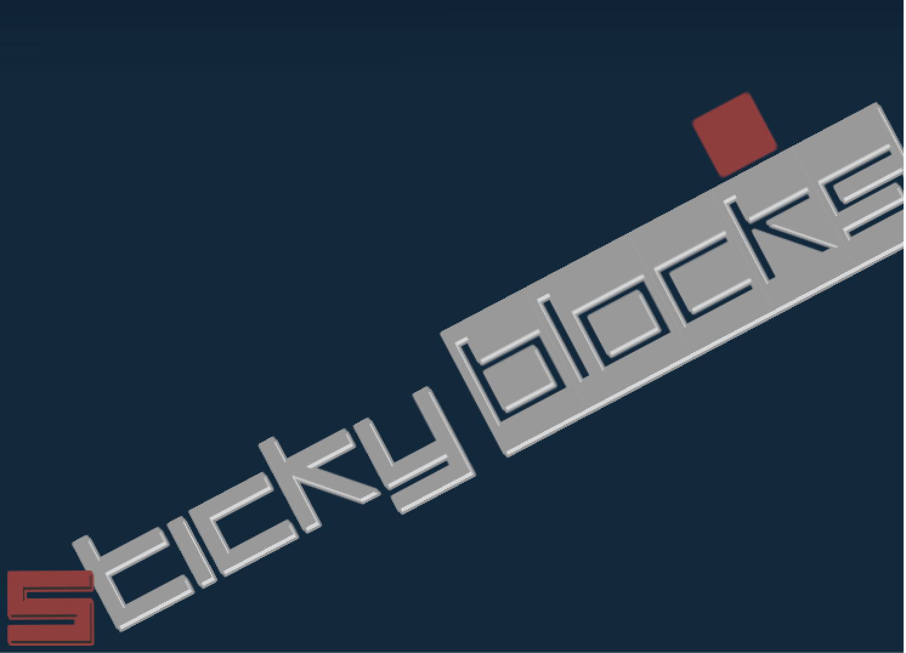
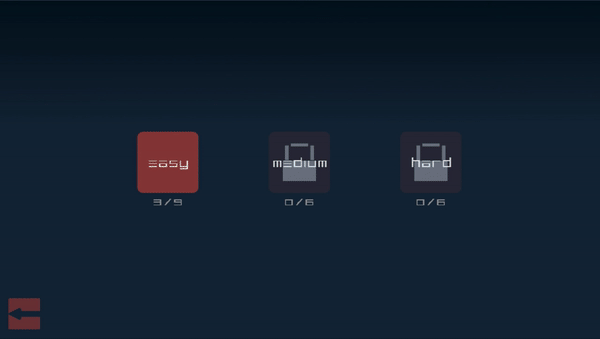
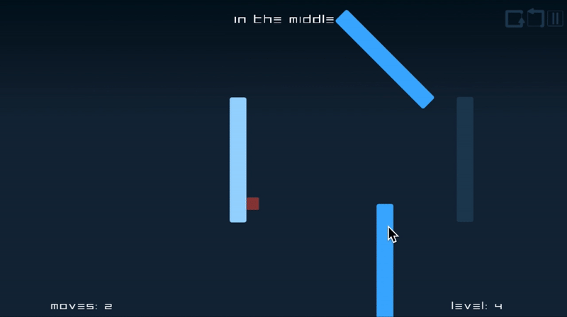
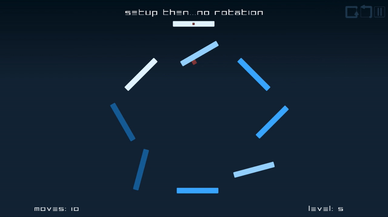

# StickyBlocks

A first game without ambitions (especially from the point of view of aesthetics and graphics). First attempt to use Godot.
`StickyBlocks` is now public in itch.io, see [StickBlocks on itch.io](https://neurodivergentgames.itch.io/stickyblocks))
## Objectives

* Build and complete a little puzzle game. 
* A pretext to learn some basics of Godot and C# (coming from C++/Python/Julia): how to structure a scalable game (multi-levels ect...), a saving-system, level/scene switching, how to export a godot-project and a lot more in the process.

 
 
 

## Progress updates

### 14/12/2021

* Completed the basic mechanics: input-movement for the player-block and the blocks;  interactions/collisions between the `PlayerBlock` and the `RotationStickyBlock`.
* Created the basic strucuture of a level (`Level` is the parent-scene of all levels)
* Created and connected a main-menu, level-selection menu, options-menu: inherit from a `MenuTemplates` (handle from code the signals of the buttons)
* Created a `GameManager` node to handle all the level-player stuff: load-level, player-data, saving-system. Receives all the signals from level-player
* Added and connected a pause menu
* Created a main scene `Main` to handle all the scene-switching and to load all the scenes. Receives all the signals from `GameManager` and all the menus. In `_Ready` loads all the scene, QueueFree the previous scene, instances and adds the next scene. (No performance issue because the scene are few and small).
* Added and connected same basic HUD elements (only the structure, not the final graphics)

### 21/12/2021

* Refactored some code and scenes
* Started thinking about some element of the possible final graphics/colors-palette
* Introduced some graphics elements: added `RotationStickyBlock` colors
* Added a reset button in `Level` (retry)
* Better (not much better!) camera movement
* Better rotation and movement of `PlayerBlock` and `RotationStickyBlock` (using Tween)
* Added to `PlayerBlock` a debug property: show `_dashDirection` line (usefull for designing levels)

### 04/01/2022

* New simpler Completed/Owned system for levels completion (based on moves counter)
* Added some WorldEnvironment effects/ animation in: owning a level, new level difficulty unlokced
* Improved/Changed zooming and camera movement: added `LevelCamera` as child of a Position2D (fixed center of the camera)
* Improved reset and back-to-last-position functions
* Created some basic-easy-tutorial levels
* Created some more complex levels
* Added initialZoom and MaxZoomConstraint as exported variables
* Added Undo/BackOneMove (only one) functionality

### 11/01/2022

* Created Easy-Medium-Hard levels classification
* Create some more levels 
* Improved relation between `MaxLevel` dictionary (in `GameManager`: total number of a specific type of level) and
  `LevelGrid` (now `LevelGrid` is instanced more programatically)
* Added explanation/tutorial animation and texts in some easy-level (new classes child of `Level`)
* Added transition between `Level` and `GameEndedMenu`
* Changed from a `CollisionShape2D` to a `CollisionPolygon2D` for `RotationStickyBlock`'s collisions
* Added name to the levels

### 18/01/2022

Code is getting messier and messier but... never mind... 
Bad/superficial/hurried choices in the basic structure and architecture of the code
are showing up.
Refactoring would take too much time, I want to move on!

* Resized screen
* New background, title screen, fonts
* New basic button scene `ButtonOptions` 
* Fixed some problems: transitions between level, paused state...
* Refactored `Level`: created `LevelWithTutorial` child-class, refactored naming and text (exported variables)
* New `OptionsMenu`
* New pause, undo, return and reset buttons-graphics

### 25/01/2022

* Added `mouse_entered`/ `mouse_exited` for every buttons in `buttonsHoverable` group (changing the modulate) and for buttons in `LevelGrid` and `LeveTypeIconMenu` scene (grabbing focus) 
* Fixed some bugs: star glow, some centering/scroll problem, star.png size
* Fixed warning for `WorldEnviroment` (star glow), now glowing-star animation is handled only by the `GameManager` 
* Create some more levels  
* Better TextureRect quality (rotation) (without allow hdpi on)  
* Fixed a problem with `GetViewport().Size()`, `Zoom` and "allow hdpi on" relation → Allow hdpi on
* Testing export in HTML5
* Tested on itch.io

### 1/02/2022

* `StickyBlocks` is now public in itch.io, see [StickBlocks on itch.io](https://neurodivergentgames.itch.io/stickyblocks))
* Updated itch.io project draft 
* Exported but with Allow hdpi off

## Progress updates

### 14/12/2021

* Completed the basic mechanics: input-movement for the player-block and the blocks;  interactions/collisions between the `PlayerBlock` and the `RotationStickyBlock`.
* Created the basic strucuture of a level (`Level` is the parent-scene of all levels)
* Created and connected a main-menu, level-selection menu, options-menu: inherit from a `MenuTemplates` (handle from code the signals of the buttons)
* Created a `GameManager` node to handle all the level-player stuff: load-level, player-data, saving-system. Receives all the signals from level-player
* Added and connected a pause menu
* Created a main scene `Main` to handle all the scene-switching and to load all the scenes. Receives all the signals from `GameManager` and all the menus. In `_Ready` loads all the scene, QueueFree the previous scene, instances and adds the next scene. (No performance issue because the scene are few and small).
* Added and connected same basic HUD elements (only the structure, not the final graphics)

### 21/12/2021

* Refactored some code and scenes
* Started thinking about some element of the possible final graphics/colors-palette
* Introduced some graphics elements: added `RotationStickyBlock` colors
* Added a reset button in `Level` (retry)
* Better (not much better!) camera movement
* Better rotation and movement of `PlayerBlock` and `RotationStickyBlock` (using Tween)
* Added to `PlayerBlock` a debug property: show `_dashDirection` line (usefull for designing levels)

### 04/01/2022

* New simpler Completed/Owned system for levels completion (based on moves counter)
* Added some WorldEnvironment effects/ animation in: owning a level, new level difficulty unlokced
* Improved/Changed zooming and camera movement: added `LevelCamera` as child of a Position2D (fixed center of the camera)
* Improved reset and back-to-last-position functions
* Created some basic-easy-tutorial levels
* Created some more complex levels
* Added initialZoom and MaxZoomConstraint as exported variables
* Added Undo/BackOneMove (only one) functionality

### 11/01/2022

* Created Easy-Medium-Hard levels classification
* Create some more levels 
* Improved relation between `MaxLevel` dictionary (in `GameManager`: total number of a specific type of level) and
  `LevelGrid` (now `LevelGrid` is instanced more programatically)
* Added explanation/tutorial animation and texts in some easy-level (new classes child of `Level`)
* Added transition between `Level` and `GameEndedMenu`
* Changed from a `CollisionShape2D` to a `CollisionPolygon2D` for `RotationStickyBlock`'s collisions
* Added name to the levels

### 18/01/2022

Code is getting messier and messier but... never mind... 
Bad/superficial/hurried choices in the basic structure and architecture of the code
are showing up.
Refactoring would take too much time, I want to move on!

* Resized screen
* New background, title screen, fonts
* New basic button scene `ButtonOptions` 
* Fixed some problems: transitions between level, paused state...
* Refactored `Level`: created `LevelWithTutorial` child-class, refactored naming and text (exported variables)
* New `OptionsMenu`
* New pause, undo, return and reset buttons-graphics

### 25/01/2022

* Added `mouse_entered`/ `mouse_exited` for every buttons in `buttonsHoverable` group (changing the modulate) and for buttons in `LevelGrid` and `LeveTypeIconMenu` scene (grabbing focus) 
* Fixed some bugs: star glow, some centering/scroll problem, star.png size
* Fixed warning for `WorldEnviroment` (star glow), now glowing-star animation is handled only by the `GameManager` 
* Create some more levels  
* Better TextureRect quality (rotation) (without allow hdpi on)  
* Fixed a problem with `GetViewport().Size()`, `Zoom` and "allow hdpi on" relation → Allow hdpi on
* Testing export in HTML5
* Tested on itch.io

### 1/02/2022

* `StickyBlocks` is now public in itch.io, see [StickBlocks on itch.io](https://neurodivergentgames.itch.io/stickyblocks))
* Updated itch.io project draft 
* Exported but with Allow hdpi off
